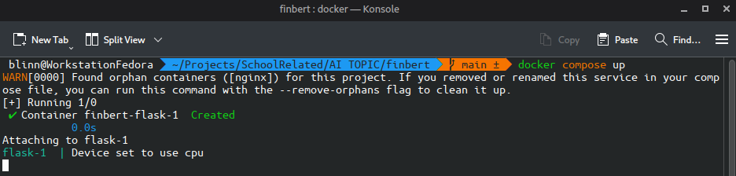
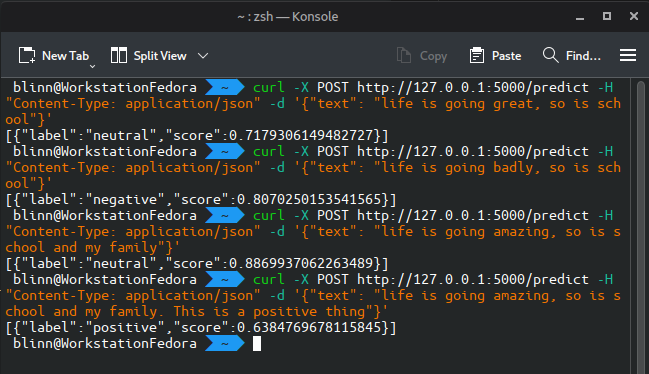
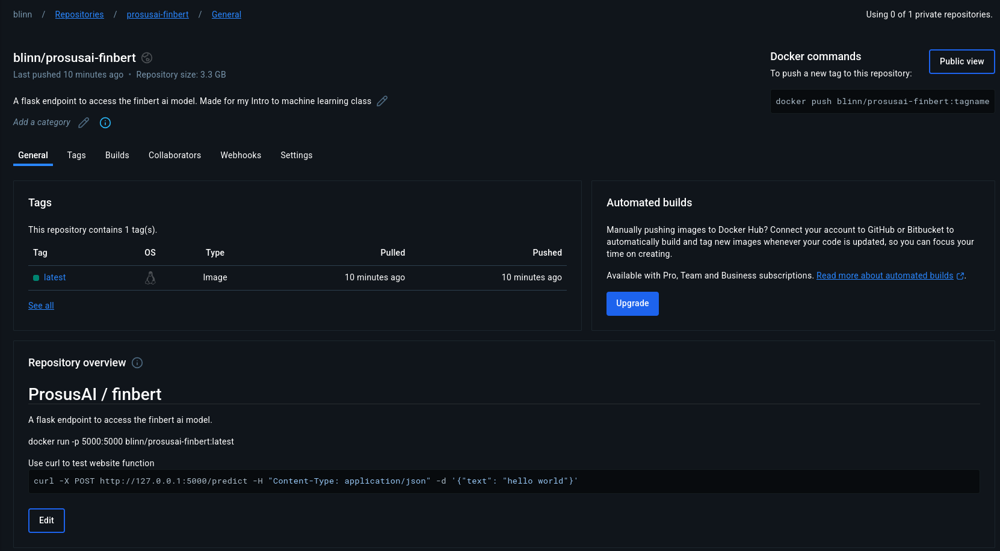

# ProsusAI / finbert
[Docker Hub Image](https://hub.docker.com/repository/docker/blinn/prosusai-finbert/general)
A flask endpoint to access the finbert ai model.


Use curl to test website function
```bash
curl -X POST http://127.0.0.1:5000/predict -H "Content-Type: application/json" -d '{"text": "hello world"}'
```

## Screenshots


